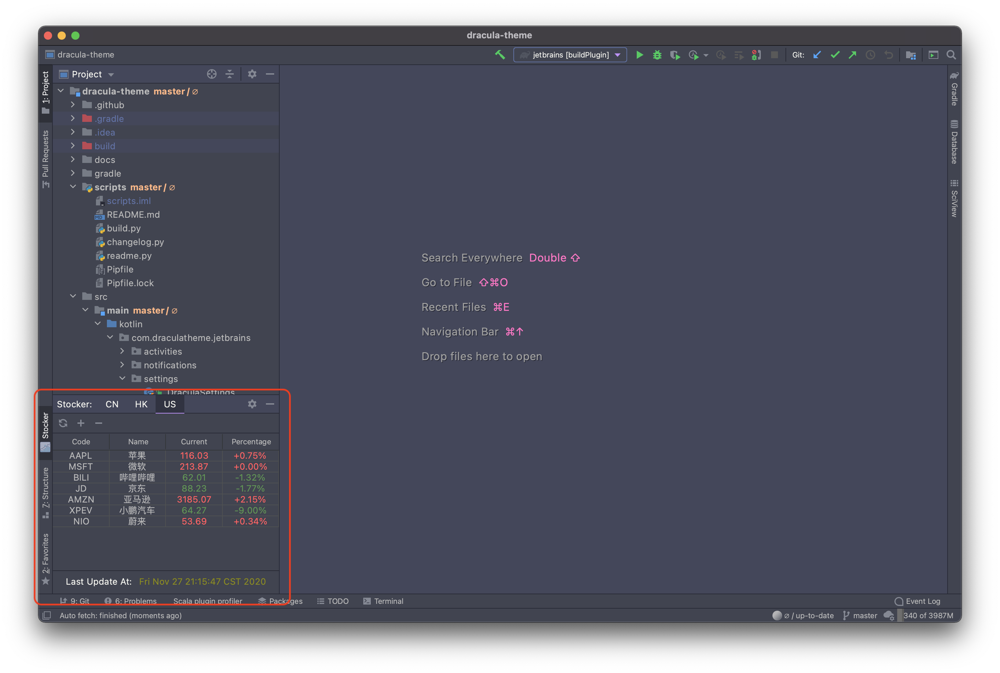
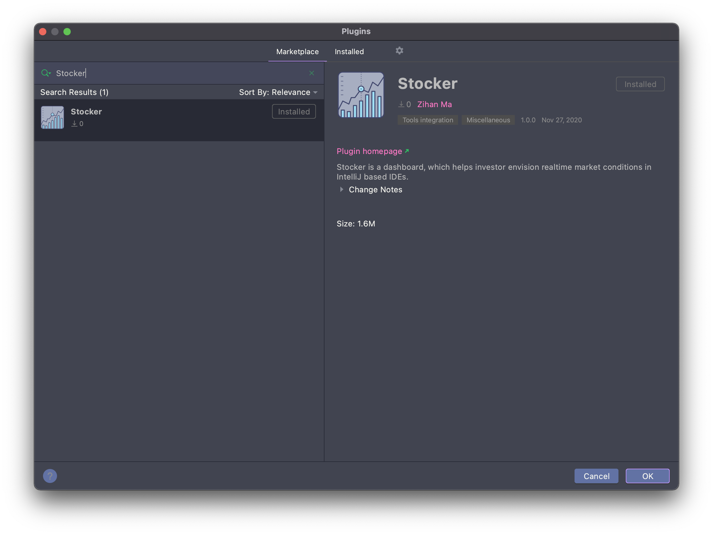

# Stocker

## Intro

**Stocker** is a dashboard, which helps investor envision realtime market conditions in JetBrains IDEs.

## Screenshot

## Installation

Search **Stocker** in `Plugin Marketplace` and click `Install`.

## Licence

Apache License
